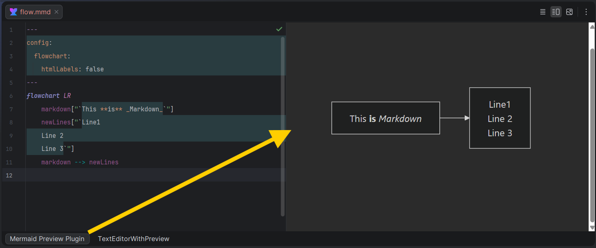

# Mermaid Preview

<!-- Plugin description -->
Adds an always-up-to-date Mermaid preview panel for .mmd and .mermaid files.
Install it alongside the built-in Mermaid plugin (`com.intellij.mermaid`) to get syntax highlighting in the editor.

This plugin provides a split-view editor for Mermaid diagram files (.mmd and .mermaid):
- **Left pane**: Text editor for writing Mermaid code
- **Right pane**: Live-rendering preview powered by Chromium (JCEF)

Features:
- Always-up-to-date rendering by loading Mermaid from the latest CDN release
- Fast split-view workflow for writing and validating diagrams side-by-side
- Full Mermaid feature coverage (flowchart, sequence, class, state, and more)
- Interactive preview with pan and zoom
- Automatic theme detection (Light/Dark mode)

<!-- Plugin description end -->

## Installation

### Manual (available now)

Download the [latest release](https://github.com/kohlerdominik/idea-mermaid-preview/releases/latest) and install it manually using
<kbd>Settings/Preferences</kbd> > <kbd>Plugins</kbd> > <kbd>⚙️</kbd> > <kbd>Install plugin from disk...</kbd>

### TODO: Marketplace

- Using the IDE built-in plugin system (Marketplace)
- Using JetBrains Marketplace website

---
Plugin based on the [IntelliJ Platform Plugin Template][template].

[template]: https://github.com/JetBrains/intellij-platform-plugin-template
[docs:plugin-description]: https://plugins.jetbrains.com/docs/intellij/plugin-user-experience.html#plugin-description-and-presentation
